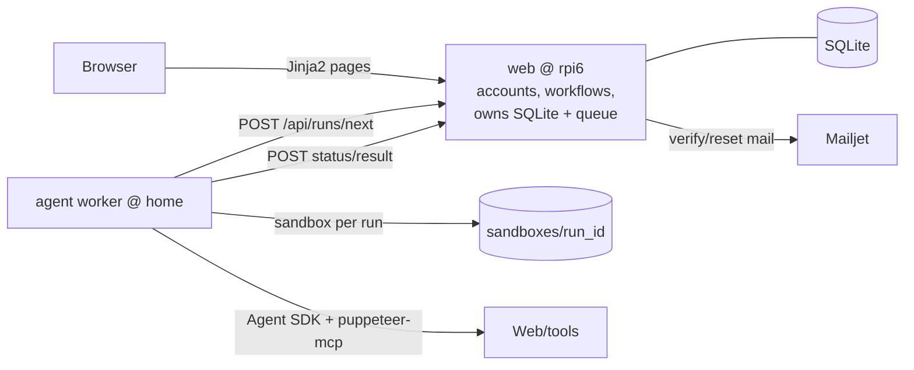

<a href="https://claude.ai"></a>

# Workflow Builder

Define agent workflows in a browser, run them, watch progress, read the result.
Each run executes in its own sandbox folder via the Claude Agent SDK.

Two Python services:

- **web/** — accounts, workflow CRUD, the run queue. Owns the SQLite DB. (host: `rpi6`)
- **agent/** — worker that claims pending runs and executes them with the Agent SDK, plus a
  read-only API to browse each run's sandbox files. (host: `home`)

The agent never touches the DB — it polls the web API and reports back.



## Accounts & roles

- First-ever signup needs no invite and becomes **Admin**.
- After that, signup requires an invite code (created by an admin).
- `user` ⊂ `editor` ⊂ `admin`:
  - **user** — run public workflows, view results.
  - **editor** — + create/edit own workflows.
  - **admin** — + invite codes, block/unblock/delete accounts.

## A workflow

Name, **sets** it belongs to (named groups that control who can see/run it — 0 sets = private),
a **model** (account default / fable / opus / sonnet / haiku — "account default" defers to the
run-starter's per-account default model, set on the **Account** page; that in turn defers to the
agent host's default), an **inputs spec** (JSON list of
`{key, label, type}`, type = `text` | `textarea` | `file`), an **action prompt** (what the agent
does), an **eval prompt** (how to summarize), and a **tools** list — registered tool names or
inline MCP server dicts, e.g. `["puppeteer", {"name": "nnn", "type": "http", "url": "https://…"}]`.
Tool names come from an admin-managed registry (**Admin → Tools**): each entry has a name, a JSON
server config (`type` + `url` required; extra keys like auth `headers` pass through to the SDK),
and an enabled flag. Names are resolved to server configs when the agent claims the run; disabled
tools are skipped with a note in the run log.

A run collects the inputs, drops files in `sandboxes/<run_id>/`, runs the action prompt,
then a read-only eval pass that produces the summary.

**Chaining:** an eval prompt can call `next_workflow("Workflow name", "handover note", inputs)` to
hand off to another workflow, which runs next **in the same sandbox** (it sees every file produced so
far). It can first call `workflow_inputs("Workflow name")` to see what the next workflow expects, then
fill those keys via the `inputs` JSON object — they become the next step's inputs. The eval prompt
holds the routing logic ("if the draft needs review, continue to …"); the whole chain is one run,
narrated step by step on the run page. Later steps get no new human input — they work off the shared
sandbox, the previous step's result, the handover note, and any filled inputs. Bounded by
`MAX_CHAIN_STEPS` (default 10).

**API endpoint:** a workflow's owner (or an admin) can attach a single named endpoint to it on the
workflow page (the button reads "Add endpoint" when none exists, and shows the endpoint name once
defined). The endpoint has a globally unique name and its own bearer token (editable, or
regenerate a random one with a click), letting external callers start runs without a browser
session. An **ⓘ** button next to the endpoint name opens a dialog with a ready-to-run `curl`
example (pre-filled with the endpoint URL, token, and the workflow's input fields) and a Copy
button:

```sh
curl -X POST https://…/workflow/api/endpoints/<name> \
  -H "Authorization: Bearer <token>" -d '{"topic": "hi", "doc": "file contents"}'
# -> {"run_id": 42, "status": "pending", "status_url": ".../api/endpoints/<name>/42"}

# or multipart, with real (binary-safe) file parts:
curl -X POST https://…/workflow/api/endpoints/<name> \
  -H "Authorization: Bearer <token>" -F topic=hi -F doc=@shot.png
```

Inputs are keyed by the workflow's inputs spec — a JSON object (a string for a `file` input is
stored as `<key>.txt`) or `multipart/form-data` with file parts for `file` inputs. The run
belongs to the workflow's owner. Poll
`GET /api/endpoints/<name>/<id>` (same token) for `{status, result, error, data}` — `data`
lists the run's sandbox files, each downloadable at `…/<name>/<id>/data/<item>`.

## Setup

Requires Python 3.12+. The **agent host** also needs Node and the Claude Code CLI,
logged in (`claude` / `claude setup-token`) — auth is the CLI's, no API key.

```sh
cp web/.env.example web/.env
cp agent/.env.example agent/.env
# set a matching AGENT_TOKEN in both; Mailjet keys are optional (unset = links printed to console)
```

## Run (local)

```sh
make migrate   # create / upgrade the SQLite schema
make web       # http://localhost:8000
make agent     # worker polling the web queue (needs CLI login)
make test      # smoke tests for both services
```

Open http://localhost:8000, sign up (you become admin), create a workflow, run it.

## Database & migrations

SQLite (`web/workflow.db`). Schema changes ship as numbered files in `web/migrations/`
(`001_init.sql`, `002_*.sql`, …), applied in order and tracked via `PRAGMA user_version`.
No ORM, no Alembic. `make migrate` (or `python web/db.py`) applies pending migrations.

## Deploy

Both services run as detached `screen` sessions on their hosts (the host convention here — no
systemd). **Neither survives a host reboot** — relaunch the screen if a box restarts. Live at
**https://rpi6.memention.net/workflow**.

**Topology**

| | host | dir | port | exposure |
|---|---|---|---|---|
| web | `rpi6` | `~/workflow-web` | `127.0.0.1:9005` | Apache strips `/workflow` → :9005 (`deploy/rpi6/workflow.conf` → `/etc/apache2/endpoints.d/`) |
| agent | `home` | `~/workflow-agent` | worker + file API on `127.0.0.1:9006` | Apache `/workflow-agent` → :9006 (`deploy/home/workflow-agent.conf`, in the 443 vhost) |

`run.sh` on each host builds the venv, installs deps, applies migrations (web), and execs the
server/worker. The web app runs `--root-path /workflow` so links/redirects/cookies work under the
sub-path. The agent reaches the puppeteer MCP on the LAN — no public tunnel.

**Prerequisites**
- SSH access (`ssh rpi6`, `ssh home`) and passwordless `sudo` on the hosts (for the Apache steps).
- `home`: Node + the Claude Code CLI **logged in** (`claude` / `claude setup-token`) — auth is the
  CLI's, never `ANTHROPIC_API_KEY`. The working binary is `~/.local/bin/claude` (the npm-global one
  can be a broken stub; `agent/run.sh` puts `~/.local/bin` first on PATH).

**First-time setup** (per host — `.env` is never synced by deploy):
```sh
make deploy-web      # rsync code + install/reload Apache conf on rpi6
make deploy-agent    # rsync code to home   (add deploy/home/workflow-agent.conf to home's 443 vhost once)
```
Then create the env files on the hosts (see the `.env.example` in each dir):
- `rpi6:~/workflow-web/.env` — `SECRET_KEY`, `AGENT_TOKEN`,
  `AGENT_FILES_URL=https://home.memention.net/workflow-agent`,
  `FRONTEND_URL=https://rpi6.memention.net/workflow`, `MAILJET_*` (optional).
- `home:~/workflow-agent/.env` — `WEB_URL=https://rpi6.memention.net/workflow`, the **same**
  `AGENT_TOKEN`, `AGENT_HTTP_PORT=9006`.

**Deploy an update**
```sh
make deploy          # both: deploy-web + deploy-agent
make deploy-web      # rsync web/   -> rpi6, install Apache conf, reload Apache
make deploy-agent    # rsync agent/ -> home
# restart the affected screen(s):
ssh rpi6 'screen -S workflow       -X quit; sleep 2; cd ~/workflow-web   && screen -dmS workflow       bash -c "./run.sh > run.log 2>&1"'
ssh home 'screen -S workflow-agent -X quit; sleep 2; cd ~/workflow-agent && screen -dmS workflow-agent bash -c "./run.sh > run.log 2>&1"'
```
Migrations apply automatically on web restart (`run.sh` → `db.py`). Logs are `run.log` in each dir
— but the worker buffers stdout, so confirm it's up with `ssh home 'pgrep -f worker.py'` rather than
tailing the log. `make deploy-web`/`deploy-agent` exclude `.env`, `*.db`, `venv`, `sandbox`/`uploads`.

## Layout

```
web/    app.py  auth.py  db.py  email_service.py  migrations/  templates/
agent/  worker.py  runner.py  client.py
Makefile
```
